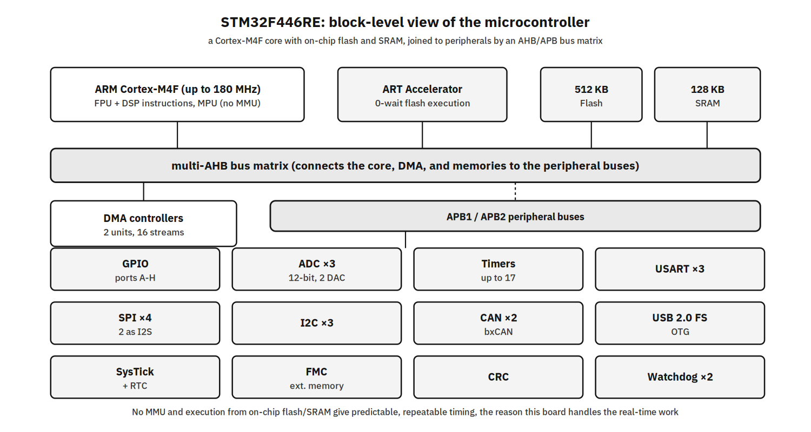

# Day 4 — RTOS Concepts and Real-Time on the Board

## Agenda for the day
**Morning (concepts)**
- Why an RTOS?
  - determinism
  - bounded latency
  - why general-purpose Linux is not real time by default.
- Core mechanisms:
  - tasks and priorities
  - preemptive scheduling
  - context-switch cost
  - semaphores
  - mutexes
  - queues,
  - priority inversion and inheritance

**Afternoon (labs)** — run tasks, break and fix priority inversion, and measure real time on the PRU and PREEMPT_RT.

## Labs at a glance
| Lab | About | Outcome |
|-----|-------|---------|
| **Lab 13 — Tasks and scheduling** | Two FreeRTOS tasks at different priorities share a queue. | You see preemptive scheduling in action. |
| **Lab 14 — Priority inversion** | Reproduce inversion, then fix it with priority inheritance. | You understand a classic real-time failure and its fix. |
| **Lab 15 — Real-time on the PRU** | A tight deterministic loop on the PRU vs a Linux thread. | You see hard determinism outside Linux. |
| **Lab 16 — PREEMPT_RT latency** | Measure scheduling latency under load with cyclictest. | You can measure latency, not guess it. |

**Day 4 outcome:** explain when an RTOS earns its place and measure latency rather than guess at it.

**The microcontroller for the FreeRTOS labs:** 

**when is "usually fast" not good enough, and what do you use instead?**
<pre>
- Contrast two systems that both react to an event in software. 
  - A doorbell chime that plays 30 ms late is fine, nobody notices
  - An airbag that fires 30 ms late is a catastrophe
- Same latency, opposite tolerance for lateness
- Embedded work is full of the second kind
  - a motor commutation that must switch on time or the motor stalls
  - a sensor that must be sampled every 1 ms or the control loop goes unstable
  - a safety cutoff that must act within a bounded window.
</pre>

**"Real time" does not mean "fast."** 
<pre>
- This is the single most important idea of the day and the most common misconception
- Real time means *the system provably meets its deadline every time, including the worst case
- A slow system with a guaranteed ceiling is real time, a blazing-fast system that occasionally 
  stalls is not.
- Hard: a miss is a system failure. Airbag, motor commutation, flight control. 
  - The deadline is a correctness requirement.
- Firm: a late result is useless but not catastrophic, you discard it. 
  - A video frame that arrives after its display slot
- Soft: lateness degrades quality but the result still has value. 
  - A UI that stutters, a log that arrives late
</pre>

**Why general-purpose Linux is not real time by default.**
<pre>
- Linux is engineered for *throughput and fairness across many jobs*, not for the worst-case 
  latency of any one job. Concretely, these introduce delays that are hard to bound on stock Linux:
- **The scheduler** (CFS) balances fairness and throughput, it does not guarantee that your important 
  thread runs within a fixed time.
- **Interrupt handling**: a burst of interrupts (network, disk) can delay your thread
- **Kernel critical sections**: when the kernel disables preemption or holds a lock, your high-priority 
  thread waits, and on stock kernels those sections are not tightly bounded.
- **Memory**: the MMU, page faults, and TLB/cache misses add variable delay. A page fault can cost 
  thousands of cycles.
- **DMA and bus contention**: other masters moving data can stall yours.
</pre>

**Which of these exist on the PRU? On the Cortex-M4 in the Nucleo?**
<pre>
- the PRU has no OS scheduler stealing time and no MMU; the Cortex-M has no MMU and runs your RTOS directly
- That absence of unpredictable machinery is *exactly* why they give determinism
- Linux on the BeagleBone runs the connected application,  the PRU or an RTOS on a microcontroller 
  handles the hard-timing piece.
</pre>


### Tasks and the scheduler

**A task is an independent function with its own stack that runs forever.** 
In FreeRTOS a task is a C function that looks like
```
void my_task(void *arg) {
    /* one-time setup */
    for (;;) {
        /* do work, then block (delay or wait on something) */
    }
}
```
<pre>
- It must never `return`
- a returning task is a bug (you either loop forever or delete the task explicitly). 
- Tasks decouple that 
  - each has its own priority and its own stack
- Each task has its own stack.
  - That is what makes tasks independent, local variables, call frames, and the saved context 
    all live on that task's stack
  - When you call `xTaskCreate(..., stackDepth, ...)` the number you pass is that stack's size 
   (in *words*, not bytes, on most ports). 
  - Undersize it and the task overflows its stack into memory it does not own, one of the most 
   common and most confusing RTOS bugs. Right-size it by measuring high-water mark (`uxTaskGetStackHighWaterMark`) 
   rather than guessing
</pre>

**Task states.** Draw the state machine and walk one task around it:
- **Running** — currently CPU is running the task (only one task per core at a time)
- **Ready** — able to run, waiting only because some higher-priority task is running
- **Blocked** — waiting for an event or a timeout (a delay, a queue item, a semaphore). Uses *no CPU*.
- **Suspended** — explicitly parked with `vTaskSuspend`, ignored by the scheduler until resumed.
Trace it: task calls `vTaskDelay`

**Priority-based preemptive scheduling.** 
- The rule is one sentence: *the highest-priority task that is Ready is the one that runs.
- In FreeRTOS, a **higher number means higher priority** (0 is lowest, `configMAX_PRIORITIES-1` is highest)
- "Preemptive" means the switch happens *immediately*
  - the moment a higher-priority task becomes Ready (say, its delay expires or the ISR it was waiting on fires),
  - it takes the CPU from whatever lower-priority task was running, mid-function, at the next instruction boundary
  - The lower priority task doesn't get to finish first

**If two Ready tasks have the *same* priority, what happens?"**
<pre>
- FreeRTOS time-slices them round-robin on each tick (if `configUSE_TIME_SLICING` is on)
- Equal priority = fair sharing
- unequal = strict preemption
</pre>

**The tick.** 
<pre>
- A periodic timer interrupt, the **tick**, drives time in the RTOS
- Its rate is `configTICK_RATE_HZ` in `FreeRTOSConfig.h` (commonly 1000 Hz = one tick per millisecond)
- On every tick the kernel checks whether any delayed task's timeout has expired (move it to Ready) and, 
  with time-slicing, whether to rotate equal-priority tasks. 
- This is why delays are quantized to the tick: a `vTaskDelay` of "1 ms" at a 1000 Hz tick is one tick, 
  ask for finer than a tick and you can't get it from `vTaskDelay`. `pdMS_TO_TICKS(ms)` converts milliseconds 
  to ticks against this exact rate, which is why the rate must be set correctly for delays to mean what you think
</pre>

**Context switch — what it costs.** 
<pre>
- When the scheduler switches from task A to task B,  it must **save A's context** 
  - the CPU registers
  - the stack pointer
  - the program counter onto A's stack and restore B's context from B's stack 
  - On a Cortex-M this is a few dozen instructions, fast, but not free, and, crucially for real time
    bounded and known. 
  - That boundedness is the point
    - you can account for switch cost in your timing budget. 
</pre>

**Blocking is the entire trick.** 
<pre>
- This is the idea that makes multitasking work
- A task that calls `vTaskDelay(pdMS_TO_TICKS(500))` or waits on a queue goes **Blocked** 
  and consumes *no CPU* for that whole period, the scheduler runs other Ready tasks instead
- Compare with a **busy-wait**:
- BUSY-WAIT — bad: burns the CPU, starves lower-priority tasks 
  volatile uint32_t i; for (i = 0; i < 1000000; i++) { }
- BLOCKING DELAY — good: yields the CPU for the duration 
  vTaskDelay(pdMS_TO_TICKS(500));

- The busy-wait keeps the task **Running**, so nothing of lower priority can run for that whole time
- The blocking delay frees the CPU. 
- Preview Lab 13's producer/consumer
  - the producer is higher priority, but it sends one value and then *blocks* for 500 ms, 
    and it is *only because it blocks* that the lower-priority consumer ever gets the CPU to print
  - If the producer busy-waited instead, the consumer would never run
</pre>

**Starvation.** 
<pre>
- The flip side
  - a high-priority task that *never blocks* starves everything below it, 
  - the lower tasks are always Ready but never highest, so they never run, it comes straight back in priority inversion 
  - A well-behaved high-priority task does a little work and then blocks (on a delay, an event, a queue), 
    leaving room for other tasks.
</pre>

### Synchronization primitives — semaphores, mutexes, queues
<pre>
- The problem first
  - Two tasks touching the same data without coordination corrupt it. 
  - a shared count++ on a 32-bit value that takes read-modify-write
  - Task A reads count, gets preempted by Task B which also reads the old value
    both increment and write back, one increment is lost
  - On wider data or structs it's worse, a reader can see a half-updated value
  - The primitives below exist to make these interactions safe
</pre>

**Queue — move data between tasks.** 
<pre>
- A queue is a fixed-length FIFO that stores **copies** of items. 
- `xQueueSend` - add the item into the 'Queue'
- `xQueueReceive` - Return the item from the 'Queue' and removes from the 'Queue'
- It also *synchronizes*
  - a receiver on an empty queue **blocks** until an item arrives
  - a sender to a full queue blocks until space frees. 
- Two properties matter
  - It copies, it does not share a pointer, so the sender can reuse or change its variable 
    immediately after sending. 
  - Blocking receive is the clean producer/consumer pattern: no polling, no busy-wait.
- Use a queue as your default for "one task produces work, another consumes it"
</pre>

**Binary semaphore — signal an event.** 
<pre>
- Producer task notifies to alert the consumer
- Consumer task retrieves the data once Producer task notifies
- The classic use is **ISR-to-task handoff**
  - the interrupt does the minimum in the handler and `xSemaphoreGiveFromISR` to wake a task 
    that does the real work at task level
- Example
  - Imagine, there is only 1 rest-room in Paying Guest room where 4 room-mates are there
    - only one person can the rest-room at a time, the door is locked while the rest room in use, 
      the other housemates wait
</pre>

**Counting semaphore — count available units.** 
<pre>
- A semaphore initialized to N, where each 'take' consumes one and each 'give' returns one 
- Example
  - the number of runways in the Airport are limited, assume 2 runnways are available in a small Airport
  - there are many flights may wanted to use the runway
    - some flight may use the runway for landing
    - some flight may use the runway for take-off
    - as the number of the runways are limited, but there are many flights this must be synchronized
</pre>

**Mutex — protect a shared resource.** 
<pre>
- A mutex enforces mutual exclusion around a critical section: take it before touching the resource, give it after. 
- Two things make a mutex different from a binary semaphore, 
  - **Ownership**: the task that takes a mutex is its owner and is the one that must give it back 
  - binary semaphore has no owner, anyone can give it
- **Priority inheritance**: because the mutex knows its owner, the RTOS can *temporarily raise the owner's priority* 
  when a higher-priority task is waiting for it. 
- **The traps.** Name them explicitly, they are where real systems break:
  - Forgetting to give the lock back → everything else waiting on it hangs
  - **Blocking while holding a lock**
    - calling a long delay or another blocking API inside a critical section 
    - you extend the time others are shut out, and can deadlock
- **Deadlock**: two tasks each hold one lock and wait for the other's. 
  - A holds lock1 and wants lock2
  - B holds lock2 and wants lock1, neither ever proceeds
  - The defense is a discipline: 
    - *always take multiple locks in the same global order everywhere.*

**Rule of thumb to leave on the board:** 
- use 'queue 'to move data
- use semaphore to signal an event
- use mutex to protect a resource
</pre>

### Priority inversion and inheritance
<pre>
- Remember, In FreeRTOS
  - higher number = highest priority
  - lower numbered priority means it has lowest priority
  - higher numbered priority means it has highest priority

- QNX
  - higher number = highest priority
  - lower numbered priority means it has lowest priority
  - higher numbered priority means it has highest priority
  
- In VxWorks RTOS
  - lower numbered Priority indicates highest priority (0)
  - higher numbered Priority indicates lowest priority (255)

- In Zephyr RTOS
  - lower numbered Priority indicates highest priority (0)
  - higher numbered Priority indicates lowest priority (255)
  
- Three tasks: **Low**, **Medium**, **High** (priorities 1, 2, 3)
- Low and High share a resource guarded by a mutex
- Medium needs does not need the mutex, it's just CPU-hungry work at middle priority

- **Low** runs first (nothing else Ready) and **takes the mutex**, entering its critical section
- **High** wakes and tries to **take the mutex**, it's held by Low, so High **blocks**. Fine so far, 
  High is *supposed* to wait briefly for Low to finish
- **Medium** wakes. Medium (priority 2) is higher than Low (priority 1) and needs no mutex, so it **preempts Low**
  Low is frozen mid-critical-section and cannot release the mutex
- Now the trap is sprung: **High (priority 3) is effectively waiting on Medium (priority 2)** to finish, 
  because Medium is starving Low, who holds the lock High needs
  The highest-priority task in the system is blocked by a *lower*-priority one, for as long as Medium chooses to run. 
  That is **priority inversion**: priorities have been turned upside down by the lock

- **Why it's dangerous, and a real example.** 
- The delay is unbounded, if Medium keeps finding work, High may *never* run, and there is no obvious bug in any single task.
- The famous case is **Mars Pathfinder (1997)**: on the surface of Mars, the lander began resetting itself repeatedly. 
- A high-priority bus-management task shared a mutex with a low-priority task; a medium-priority comms task preempted the 
  low one at the wrong moment; the high task missed its deadline; a watchdog saw the miss and reset the system. 
- It was diagnosed and *fixed remotely* by enabling priority inheritance. 
- **The fix — priority inheritance.
  - High tries, blocks, *and* Low is immediately boosted to priority 3
  - Medium wakes, but Medium (2) can no longer preempt Low (priority now is 3), so Low keeps running
  - Low finishes its critical section quickly and **gives the mutex**; its priority drops back to 1; 
  - High immediately takes the mutex and runs. Deadline resolved.
The boost lasts only while the lock is held, exactly the window where it's needed.

- **Why this is a mutex feature specifically.** 
  - Inheritance requires knowing *whose* priority to boost, that is, the lock's owner. 
  - A mutex tracks ownership; a binary semaphore does not. 
  - This is the concrete reason "use a mutex, not a binary semaphore, to protect a resource,"
</pre>

## Hardware required for Day 4
| Item | Used by |
|------|---------|
| STM32 Nucleo board + USB (ST-Link) cable | Lab 13, 14 |

## Install (HOST)
- FreeRTOS toolchain for the Nucleo (`arm-none-eabi-gcc` + your SDK).
- PRU C compiler (TI PRU Code Generation Tools) for Lab 15.
- On the **BOARD** for Lab 16: `sudo apt install -y rt-tests stress-ng`.

## Lab 13 — Tasks and scheduling
**Objective:** two tasks at different priorities share a queue; the higher-priority task runs first when ready.
**Source:** [`Lab13-TasksScheduling/src/tasks.c`](Lab13-TasksScheduling/src/tasks.c)
```c
static void producer(void *arg) {          /* higher priority */
    int n = 0;
    for (;;) { xQueueSend(q, &n, portMAX_DELAY); n++; vTaskDelay(pdMS_TO_TICKS(500)); }
}
static void consumer(void *arg) {          /* lower priority */
    int v;
    for (;;) if (xQueueReceive(q, &v, portMAX_DELAY) == pdTRUE) printf("got %d\n", v);
}
int main(void) {
    q = xQueueCreate(8, sizeof(int));
    xTaskCreate(producer, "prod", 256, NULL, 3, NULL);   /* prio 3 */
    xTaskCreate(consumer, "cons", 256, NULL, 1, NULL);   /* prio 1 */
    vTaskStartScheduler(); for (;;);
}
```
**Run — on the HOST:** build with your FreeRTOS project and flash to the Nucleo over USB (ST-Link).
**Expected output:** the consumer prints an increasing sequence; the high-priority producer always runs when ready (visible in the log or on a scope).

---

## Lab 14 — Priority inversion
**Objective:** reproduce inversion (low holds a lock high needs while medium hogs the CPU), then fix it.
**Source:** [`Lab14-PriorityInversion/src/inversion.c`](Lab14-PriorityInversion/src/inversion.c)
```c
// Without inheritance, high waits for medium -> inversion.
// FIX: xSemaphoreCreateMutex() (a MUTEX) boosts 'low' to high's priority
//      while it holds the lock, so medium cannot delay high.
m = xSemaphoreCreateMutex();                         // fixed
// m = xSemaphoreCreateBinary(); xSemaphoreGive(m);   // to reproduce the inversion
```
**Run — on the HOST:** flash to the Nucleo; toggle the semaphore type to switch broken/fixed.
**Expected output:** with a binary semaphore the high task is delayed (inversion); with the mutex, priority inheritance lets it run on time.

---

## Lab 15 — Real-time on the PRU
**Objective:** a tight, deterministic loop on the PRU, independent of Linux; compare against a Linux thread.
**Source:** [`Lab15-PRURealTime/src/pru_blink.c`](Lab15-PRURealTime/src/pru_blink.c)
```c
volatile register uint32_t __R30;   /* PRU output register */
void main(void) {
    CT_CFG.SYSCFG_bit.STANDBY_INIT = 0;
    while (1) {
        __R30 |=  (1 << 5); __delay_cycles(100000000);   /* pin high, exact cycles */
        __R30 &= ~(1 << 5); __delay_cycles(100000000);   /* pin low */
    }
}
```
**Run — on the BOARD**
```bash
# build with the PRU compiler, then load and start via remoteproc:
echo am335x-pru0-fw | sudo tee /sys/class/remoteproc/remoteproc1/firmware
echo start          | sudo tee /sys/class/remoteproc/remoteproc1/state
```
**Expected output:** a scope on the PRU pin shows a rock-steady square wave; the same toggle from a Linux thread jitters under load.

## Lab 16 — PREEMPT_RT latency
**Objective:** measure scheduling latency under load and compare against the PRU.
**Run — on the BOARD (running a PREEMPT_RT kernel)**
```bash
sudo apt install -y rt-tests stress-ng
sudo cyclictest -m -p90 -i200 -h400 &      # the MAX latency is what counts
stress-ng --cpu 4 --io 2 --timeout 60s     # load it while measuring
```
**Expected output:** `cyclictest` reports a bounded worst-case latency far tighter than a stock kernel — but still larger and less certain than the PRU.

## Lab1 - Mutex
```
cd ~
git clone https://github.com/tektutor/embedded-linux-and-device-drivers-for-ather.git
cd embedded-linux-and-device-drivers-for-ather
git pull
cd Day4/FreeRTOS-Labs-STM32F446RE/Labs/Lab01-Mutex
make
make flash

# ON Terminal tab 1
minicom -D /dev/ttyACM0 -b 115200

# Manually press the reset button on the board
# At this point you see the board output on the Terminal tab 1
```


## Info - Step by Step procedure that one can follow to build their first application for a particular board
<pre>
- In our case, we have STM32 Nucleo F446RE
- Step 1: Identify Your Exact MCU
  - Nucleo-F446RE board carries the STM32F446RET6 microcontroller
  - That full part number tells you everything
    R = 64-pin LQFP package
    E = 512 KB Flash
    T = LQFP package type
    6 = industrial temperature range (-40 to 85°C)
  - You need this to pick the right startup file, linker script, and peripheral register definitions
- Step 2: Get the STM32CubeF4 Firmware Package
  - ST provides all drivers, headers, and startup code in a single package called STM32CubeF4.
  - Navigate to st.com website and search STM32CubeF4 or directly go to https://www.st.com/en/embedded-software/stm32cubef4.html
  - Click "Get Software" followed by "Get Latest", this will download stm32cubef4-v1-28-0.zip ( as of today this is the latest, might vary later )
  - You may also download the Databrief, to understand what is there in the zip package
- Step 3: Extract the zip and navigate to Drivers/CMSIS/Device/ST/STM32F4xx/Include/ and confirm you can see stm32f446xx.h
  - That file is the proof you have the right package for your Nucleo-F446RE board
- Step 4: Then check Projects/STM32F446RE-Nucleo/ for ready-made example projects. 
  - ST ships GPIO toggle, UART echo, and timer examples specifically for your board
  - Start with one of those rather than writing everything from scratch
</pre>
